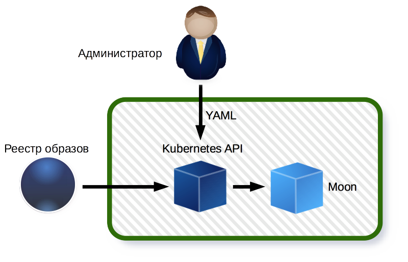
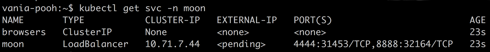
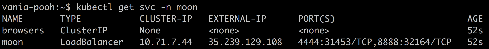
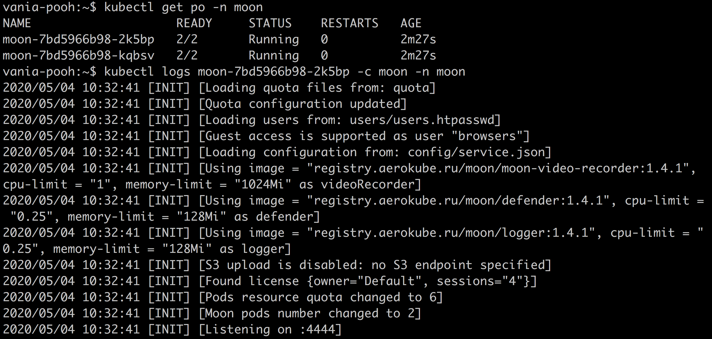

= Инструкция по установке ПО «Moon»
:revdate: {docdate}
:toc-title: Содержание
:front-cover-image: images/cover.png
:toc: left
:toclevels: 3
:sectnums:
:sectanchors:
:author: ООО "Аерокуб"
:revnumber: latest
:icons: font
:source-highlighter: coderay
:docinfo: shared

== О документе

Документ предназначен для технических специалистов, которые хотят установить полнофункциональную версию ПО «Moon».

== Глоссарий

**Программный процесс** - запущенный и работающий виде процесса операционной системы экземпляр программного обеспечения.

**Контейнеризация** - легковесная технология изоляции программных процессов, построенная на низкоуровневых возможностях ядра операционной системы Linux. Позволяет изолировать процессы по процессорным ядрам, оперативной памяти, сетевым подключениям, файловой системе. Работает значительно быстрее традиционной гипервизорной виртуализации. Примеры контейнерных технологий: https://www.docker.com/[Docker], https://coreos.com/rkt/[rkt].

**Контейнер** - программный процесс, изолированный от других программных процессов средствами контейнеризации.

**Образ контейнера** – архив специального формата, содержащий исполняемую программу, а также полный набор зависимостей (операционную систему, системные утилиты, библиотеки и другие данные), необходимых для ее правильной работы.

**Реестр образов (registry)** – специальное централизованное хранилище образов контейнеров, имеющее программный интерфейс (API) и позволяющее загружать, хранить и скачивать образы пользователю и другим программам.

**Микросервисная архитектура** – архитектура приложения, в которой оно разделено на несколько небольших взаимодействующих между собой компонентов (микросервисов), запускаемых по-отдельности.

**Kubernetes** - распространяемое под лицензией Apache 2.0 и доступное по ссылке https://github.com/kubernetes/kubernetes программное решение с https://github.com/kubernetes/kubernetes[открытым исходным кодом] для автоматического распределения произвольного количества контейнеров по произвольному набору серверов или виртуальных машин. Для загрузки образов запускаемых контейнеров Kubernetes использует совместимый с ним реестр образов.

**Openshift** - распространяемое под лицензией Apache 2.0 и доступное по ссылке https://github.com/openshift/origin https://github.com/openshift/origin[программное решение] от компании https://www.redhat.com/[RedHat], построенное на основе Kubernetes и в значительной степени совместимое с ним.

**Сетевой балансировщик (LoadBalancer)** - специальное программно-аппаратное решение для распределения сетевых запросов по нескольких работающим копиям программного обеспечения, работающее на сетевом (L3) уровне https://en.wikipedia.org/wiki/OSI_model[модели OSI], например, Yandex Load Balancer (https://cloud.yandex.ru/services/load-balancer, https://cloud.yandex.ru/docs/load-balancer/).

**Ингресс (Ingress)** - решение для распределения сетевых запросов по нескольких работающим копиям программного обеспечения, работающее на прикладном (L7) уровне https://en.wikipedia.org/wiki/OSI_model[модели OSI], например, Ingress на основе веб-сервера Nginx (https://github.com/nginx/nginx, https://github.com/kubernetes/ingress-nginx).

**Под (Pod)** - набор из одного или нескольких контейнеров, имеющих одинаковый сетевой адрес и запускаемых как единое целое в кластере Kubernetes \ Openshift.

**Сервис (Service)** - специальная сущность в Kubernetes \ Openshift, позволяющая назначить одному или нескольким подам постоянное доменное имя и определить алгоритм балансировки сетевой нагрузки на эти поды.

**Пространство имен** или **Неймспейс (Namespace)** или **Проект (Project)** - специальная сущность Kubernetes \ Openshift, позволяющая группировать остальные сущности в изолированные группы.

**YAML** - текстовый формат хранения данных, описанный на сайте https://yaml.org/[https://yaml.org/].

**Манифест** - текстовое описание набора подов, сервисов, сетевых балансировщиков и других сущностей Kubernetes \ Openshift, которые требуется запустить для правильной работы ПО «Moon».

**Selenium WebDriver** - распространяемый под открытой лицензией и доступный по ссылкам https://github.com/w3c/webdriver/ и https://www.w3.org/TR/webdriver/ программный протокол для запуска и управления браузерами и мобильными тестовыми средами, работающий поверх протокола HTTP. Часто вместо полного названия Selenium WebDriver взаимозаменяемо употребляются просто Selenium или WebDriver.

**Selenium URL** - сетевой адрес, используемый для запуска браузеров по протоколу Selenium и для взаимодействия с уже запущенными браузерами.

== Системные требования

* Современная операционная система (Linux, MacOS, Windows), имеющая интерпретатор командной строки
* **Для Kubernetes:** работающий кластер Kubernetes версии 1.13 и выше и установленная утилита **kubectl**, распространяемая под лицензией Apache 2.0 и доступная по ссылке https://github.com/kubernetes/kubectl
* **Для Openshift:** работающий кластер Openshift 3.10 и выше и установленная утилита **oc**, распространяемая под лицензией Apache 2.0 и доступная по ссылке https://github.com/openshift/oc

== Установка
=== Особенности установки

В отличие от традиционного серверного программного обеспечения, поставляемого и запускаемого на операционных системах в виде бинарных исполняемых файлов, ПО «Moon» имеет микросервисную архитектуру и может быть запущено только внутри распространяемых под лицензией Apache 2.0 кластера Kubernetes или Openshift. В связи с этим, а также для удобства развертывания (установки), ПО «Moon» распространяется в формате образов контейнеров. Установка заключается в загрузке специальных машиночитаемых инструкций по установке в виде YAML манифестов и запуске команды на выполнение этих инструкций. В инструкциях описано какие компоненты ПО «Moon» нужно запустить, какие для этого нужны образы контейнеров, сколько независимых копий (реплик) ПО будет запущено, сколько вычислительных ресурсов (процессорных ядер и оперативной памяти) нужно выделить, какой тип сетевого балансировщика нужно использовать и так далее.  После запуска команды кластер Kubernetes или Openshift автоматически скачивает образы нужных контейнеров и выполняет все описанные инструкции из YAML манифеста.

=== Основные компоненты

В таблице приведены основные компоненты (микросервисы) ПО «Moon»:

|===
| Образ контейнера | Назначение
| registry.aerokube.ru/moon/moon | Реализация протокола WebDriver (основной микросервис)
| registry.aerokube.ru/moon/moon-api | Программный интерфейс (API)
| registry.aerokube.ru/moon/defender | Компонент защиты браузера
| registry.aerokube.ru/moon/logger | Компонент обработки логов
| registry.aerokube.ru/moon/moon-video-recorder | Компонент видеозаписи
|===

Все указанные в таблице образы контейнеров хранятся в централизованном реестре образов **https://registry.aerokube.ru/**.

=== Установка в Kubernetes

Готовый YAML манифест для разворачивания (установки) ПО «Moon» размещены по ссылке https://aerokube.ru/files/moon.yaml.

. Загрузите готовые YAML манифесты для разворачивания ПО «Moon» (например, при помощи `wget`):

    $ wget -O moon.yaml https://aerokube.ru/files/moon.yaml

. Выполните одну команду для запуска ПО «Moon», которая позволяет выполнить загруженный манифест `moon.yaml`:

    $ kubectl apply -f moon.yaml
    namespace/moon created
    role.rbac.authorization.k8s.io/moon created
    rolebinding.rbac.authorization.k8s.io/moon created
    service/moon created
    service/browsers created
    deployment.apps/moon created
    configmap/config created
    configmap/quota created
    secret/users created
    secret/licensekey created

+
По-умолчанию ПО «Moon» запускается в отдельном пространстве имен `moon`, для чего во всех последующих командах необходимо добавление `-n moon`, как показано ниже.
. Дождитесь пока будет выдан внешний IP-адрес у LoadBalancer:
+

+
Когда операция завершится, это будет выглядеть вот так:
+

+
Теперь выданному IP-адресу может быть дополнительно присвоено доменное имя:

    $ host moon.example.com
    moon.example.ru has address 104.154.161.58

. Установка завершена! Теперь может осуществляться запуск требуемых Selenium-тестов, используя следующий Selenium URL:

    http://104.154.161.58:4444/wd/hub

+
Для того, чтобы убедиться, что Moon успешно запустился, можно вывести журнал его работы:
+

+
NOTE: При первом запуске тестов для каждой версии браузера Kubernetes будет осуществлять загрузку и кеширование образа контейнера этой версии браузера на диске. В зависимости от скорости сетевого соединения это может занять несколько минут.
+
При использовании доменного имени Selenium URL выглядит так:

    http://moon.example.com:4444/wd/hub
+
Список доступных версий браузеров можно получить посредством выполнения запроса:

    $ curl -s http://104.154.161.58:8888/status
    {"total":4,"used":0,"queued":0,"pending":0,"browsers":{"chrome":{"81.0":{}},"firefox":{"75.0":{}}}}

=== Установка в Openshift

Готовый YAML манифест для разворачивания (установки) ПО "Moon" размещены по ссылке https://aerokube.ru/files/moon-openshift.yaml.

. Загрузите готовые YAML манифесты для разворачивания ПО «Moon» (например, при помощи `wget`):

    $ wget -O moon-openshift.yaml https://aerokube.ru/files/moon-openshift.yaml

. Добавьте права на редактирование (`edit`) учетной записи `default`, чтобы ПО «Moon» мог получить доступ к информации («прочитать» информацию) о максимальном количестве подов, разрешенных для запуска в кластере, выполнив соответствующую команду, как показано ниже:

    $ oc policy add-role-to-user edit system:serviceaccount:moon:default
+
Данный пример показан для запуска ПО «Moon» в проекте с именем `moon`.

. Запустите ПО «Moon» при помощи утилиты `oc` и загруженного выше файла манифеста `moon-openshift.yaml`:

    $ oc create -f moon-openshift.yaml -n moon

. Установка ПО «Moon» завершена! Теперь может осуществляться запуск Ваших Selenium тестов, используя IP адрес от сервиса `moon` и сетевой порт `4444`, например, как показано ниже:

    http://<moon-ip-or-hostname>:4444/wd/hub
